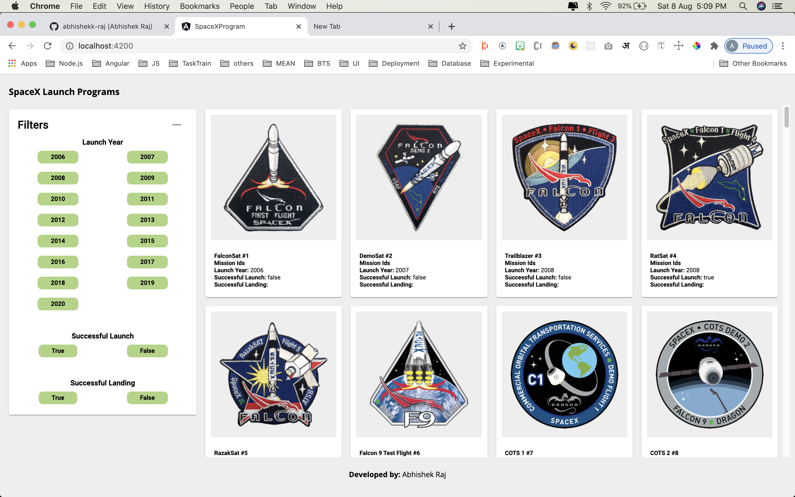
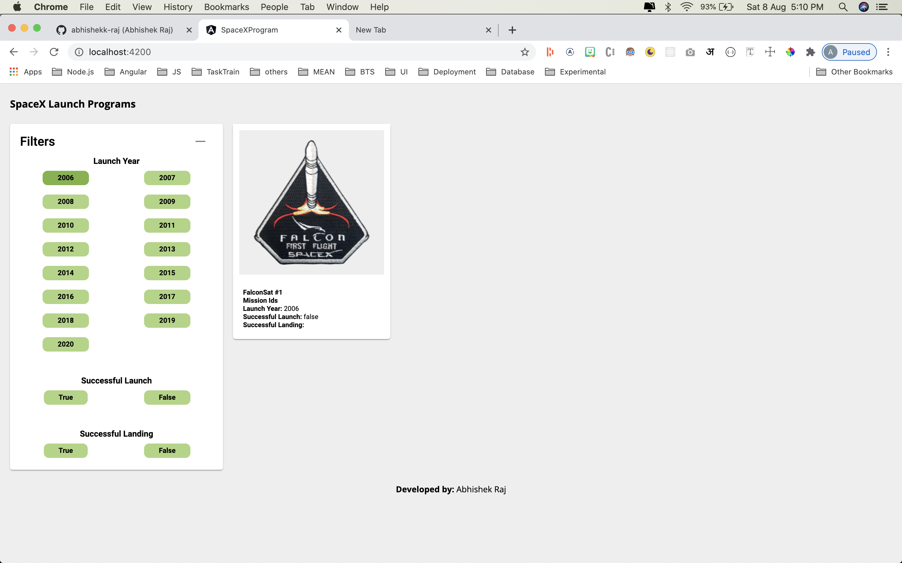
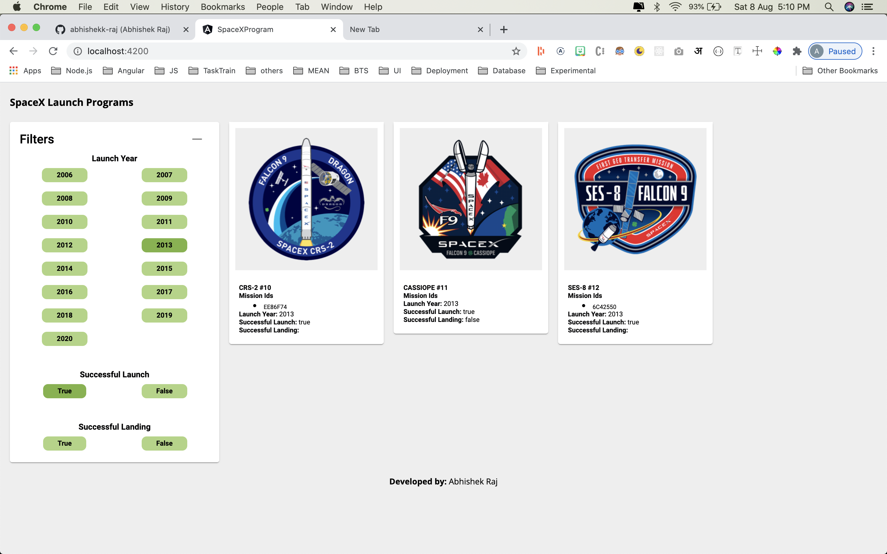
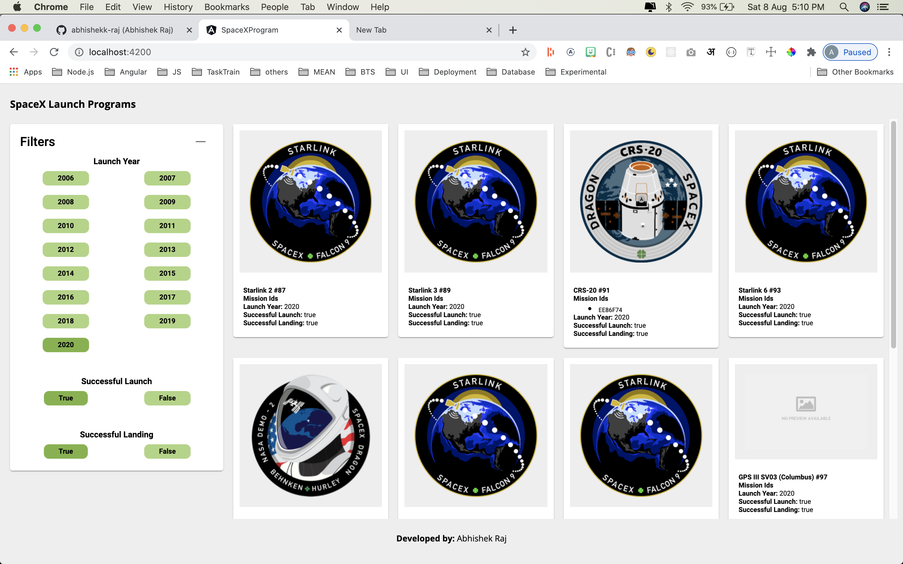
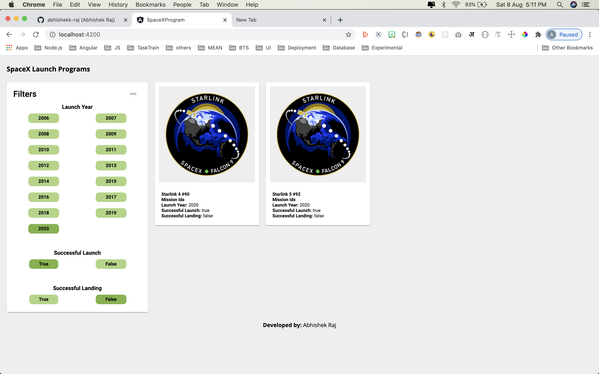
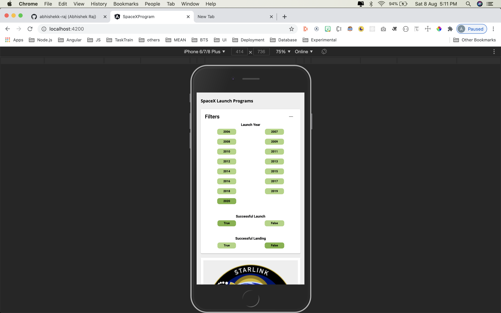
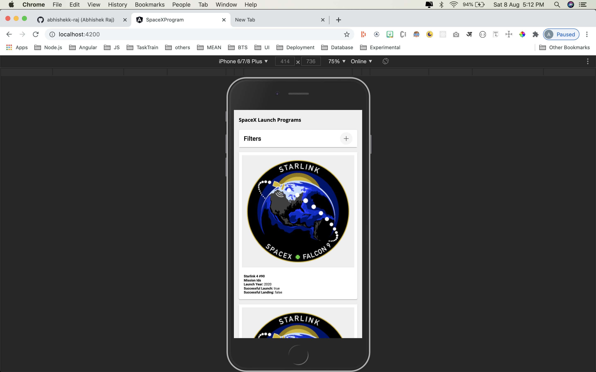
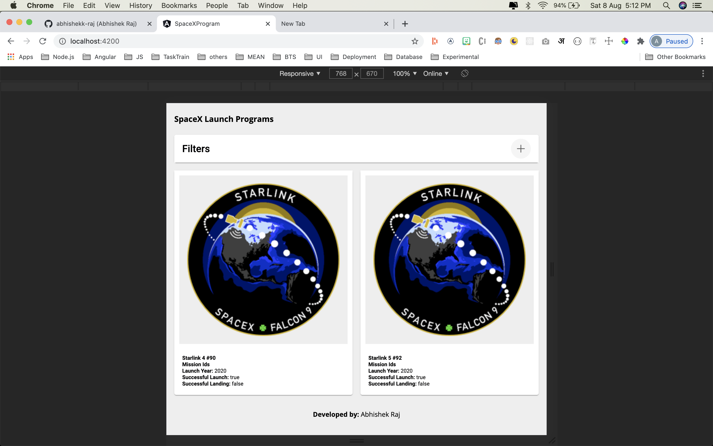
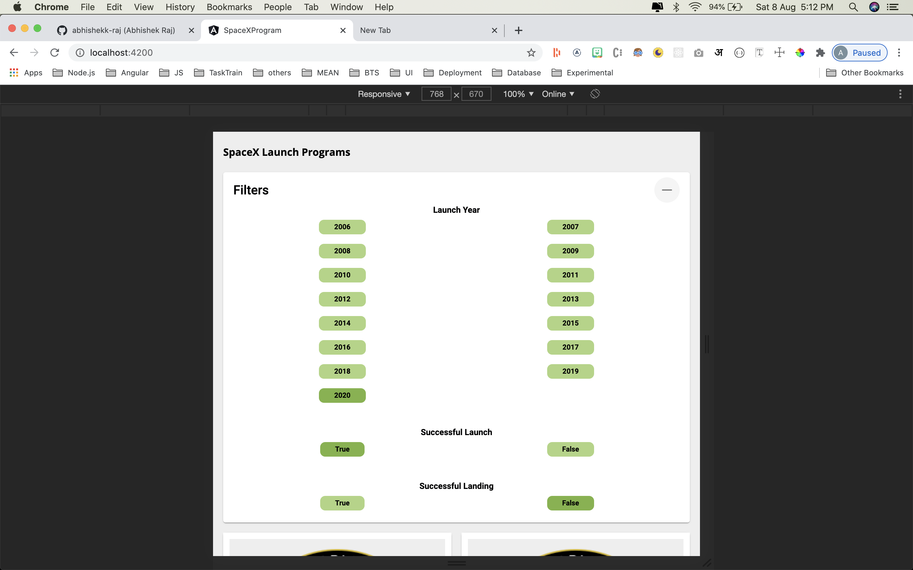

# SpaceXProgram

This is Frontend application created with Angular CLI version 10.0.5.

### Description

This is a front-end application which would help users to list and browse all launches by SpaceX program. It's fully responsive application, can be fit to any screen size.

## Prerequisite

* Install node version ^10
* Install Angular CLI version 10.0.5

## Project Setup

* Clone repository - `https://github.com/abhishekk-raj/SpaceXProgram.git`
* Goto project directory - `cd SpaceXProgram`
* Install dependencies - `npm install`

## Run Project

* Run command `npm run start` to run the project
* Run command `npm run lint` to test linting issues

## Project Preview

#### Programs without a filter - Desktop

#### Programs with Year filter - Desktop

#### Programs with Year and Launch filter - Desktop

#### Programs with Year, Launch and Landing filter - Desktop

#### Programs with Year, Launch and Landing filter - Desktop

#### Programs with Year, Launch and Landing filter - Mobile

#### Programs with Year, Launch and Landing filter - Desktop

#### Programs with Year, Launch and Landing filter - iPad

#### Programs with Year, Launch and Landing filter - iPad

